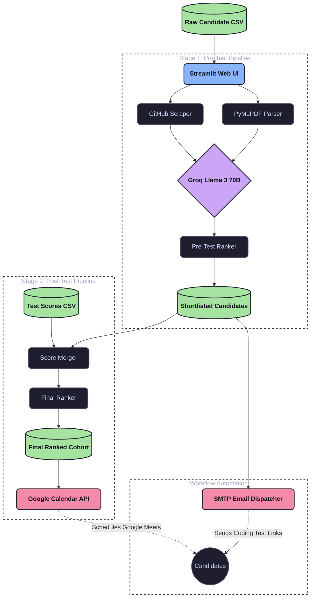

# Architecture: Student Evaluation Platform

This document outlines the high-level architecture, pipeline stages, and file structure of the AI-powered Student Evaluation Platform.

## Overview

The platform is a Streamlit-based web application designed to evaluate software engineering candidates using a two-stage pipeline. It integrates with large language models (LLMs) via the Groq API for intelligent resume parsing and GitHub profile analysis, and natively hooks into Google APIs for automating email workflows and calendar scheduling.

The application is entirely stateless between runs. The data flows progressively from a raw uploaded spreadsheet, through the Stage 1 AI evaluation pipeline, to a shortlist where test link emails are dispatched, and finally into Stage 2 where manual test results are merged and interviews are scheduled via Google Calendar.

## System Design (Data Flow)



## Tech Stack

* **Frontend/Backend:** [Streamlit](https://streamlit.io/) (Python)
* **LLM Provider:** [Groq](https://groq.com/) API (Llama 3 70B model)
* **PDF Parsing:** PyMuPDF (`fitz`)
* **GitHub Analysis:** GitHub REST API (`requests`) — profile, repo list, README, and topics
* **Email:** Python `smtplib` / `email.mime`
* **Scheduling:** Google Calendar API (`google-api-python-client`)
* **Data Processing:** Pandas

## Pipeline Architecture

The platform strictly enforces a chronological, two-stage evaluation process:

### Stage 1: Pre-Test Evaluation

This stage evaluates candidates based on their preliminary materials before they take any technical test.

1. **Input:** User uploads a CSV/Excel file containing Candidate Name, Email, Resume Link, GitHub Link, and CGPA.
2. **Resume Evaluation:** Downloads the PDF resume, extracts the text using PyMuPDF, and feeds it to the LLM along with the provided Job Description (JD). The LLM returns a score (out of 100) and a reasoning string.
3. **GitHub Evaluation:** Fetches the candidate's GitHub profile via the GitHub REST API — public repo count, followers, and the top 5 most recently pushed original repos (forks excluded), each with a cleaned README (topics + description included) — and evaluates it against the JD via the LLM.
4. **Pre-test Ranking:** Calculates a weighted pre-test score using a fixed formula (Resume: 50%, GitHub: 40%, CGPA: 10%). A candidate with a missing or broken GitHub link/fetch gets a 30/100 floor on the GitHub component instead of a bare 0, so a blank field doesn't disproportionately tank their rank.
5. **Email Dispatch:** The user selects the top $N$ candidates. The system uses a ThreadPoolExecutor to concurrently connect to Gmail SMTP and send personalized test link invitations to the shortlisted candidates.

### Stage 2: Post-Test Finalization

This stage occurs after the shortlisted candidates have completed the external coding test.

1. **Test Results Input:** User uploads the external test results (CSV/Excel) containing the candidate's unique `s_no` and their test scores (`test_code`, `test_la`).
2. **Score Merging:** The system performs a left-join on the `s_no` to merge the new test scores with the existing shortlisted candidates from Stage 1. Candidates with no matching row in the test-results sheet (did not attempt the test) receive `test_la`/`test_code` of 0, not a fallback to any other source — the Test Result sheet is the sole authority for these two fields at this stage.
3. **Final Ranking:** Calculates the absolute final score using the comprehensive weighting schema (Resume: 35%, GitHub: 25%, CGPA: 5%, Test Code: 20%, Test LA: 15%).
4. **Interview Scheduling:** The system creates calendar events for the top candidates via the Google Calendar API, generating Google Meet links and automatically sending calendar invites to the candidates and the interviewer.

## Directory Structure

```text
student_Evaluation_Platform/
├── app.py                      # Main Streamlit application and UI routing
├── requirements.txt            # Python dependencies
├── .env                        # Environment variables (API keys, credentials)
├── credentials.json            # Google OAuth 2.0 client credentials
├── token.json                  # Generated OAuth token for Google Calendar access
├── refresh_google_token.py     # Helper script to manually authenticate and generate token.json
│
└── src/
    ├── common/
    │   ├── llm_client.py       # Wrapper for the Groq API client
    │   └── ranking_utils.py    # Shared math/utility functions for scoring
    │
    ├── stage1_pretest/
    │   ├── orchestrator.py     # Pipeline controller for Resume + GitHub evaluations
    │   ├── emailing/
    │   │   └── sender.py       # SMTP logic for bulk-sending test links
    │   ├── github_evaluation/
    │   │   ├── fetcher.py      # GitHub REST API client — profile, repos, README, topics
    │   │   ├── evaluator.py    # LLM scoring of the fetched GitHub data against the JD
    │   │   ├── models.py       # Pydantic models: GitHubProfileData, GitHubRepo, GitHubEvaluation
    │   │   └── pipeline.py     # Per-candidate fetch + evaluate orchestration
    │   ├── ranking/
    │   │   └── pre_test_ranker.py # Calculates the 50/40/10 pre-test score
    │   └── resume_evaluation/
    │       ├── evaluator.py    # LLM logic for comparing resume text to the JD
    │       ├── models.py       # Pydantic data structures for evaluation results
    │       ├── parser.py       # PyMuPDF logic for downloading and reading PDFs
    │       └── pipeline.py     # Controls the sequential batching of resume parsing
    │
    └── stage2_posttest/
        ├── score_merger.py     # Left-joins the Stage 1 shortlist with Stage 2 test results
        ├── ranking/
        │   └── post_test_ranker.py # Calculates the comprehensive final score (out of 100)
        └── scheduling/
            └── calendar.py     # Google Calendar API integration for booking interviews
```

## Concurrency & Rate Limiting

- **LLM Rate Limiting:** Because free-tier LLM APIs (like Groq) have strict Token-Per-Minute (TPM) limits, the Stage 1 pipeline intentionally processes candidates sequentially with a `time.sleep(1)` delay between requests. This prevents `429 Too Many Requests` errors when evaluating large datasets.
- **SMTP Concurrency:** Sending emails natively via `smtplib` is slow (~4 seconds per email). The email dispatcher uses a `concurrent.futures.ThreadPoolExecutor` to parallelize connections, reducing the time to send 10 emails from 40 seconds to under 5 seconds.

## Data Privacy & State

- **Stateless:** The Streamlit application maintains all state (DataFrames, LLM responses, extracted text) entirely in memory via `st.session_state`. If the browser tab is refreshed, the state is cleared.
- **No Local Storage:** No candidate resumes, generated scores, or API keys are permanently saved to the local disk by the pipeline (except when the user manually clicks "Download CSV").
